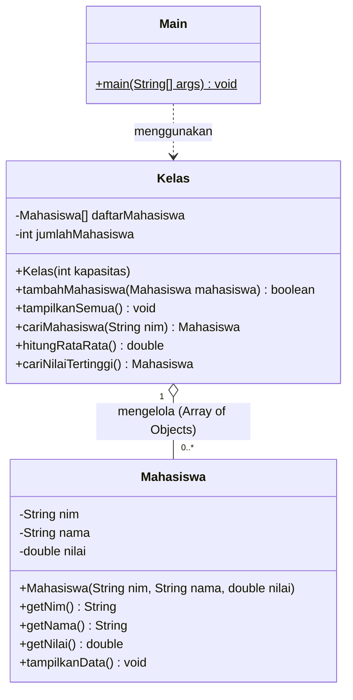
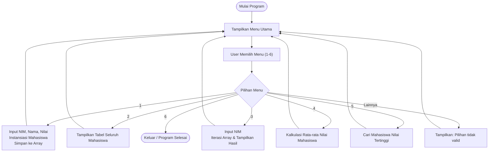

# Aplikasi Nilai Mahasiswa

Aplikasi berbasis **Java Console** untuk mengelola data nilai mahasiswa. Proyek ini dibuat sebagai tugas mata kuliah **Object-Oriented Programming (OOP)** dengan menerapkan konsep **Array of Objects** serta prinsip dasar OOP.

---

## 📌 Fitur Aplikasi

* ➕ **Tambah Mahasiswa**: Menginput NIM, nama, dan nilai mahasiswa ke dalam array objek.
* 📋 **Tampilkan Semua Data**: Menampilkan daftar seluruh mahasiswa dalam format tabel rapi.
* 🔍 **Cari Mahasiswa**: Mencari data mahasiswa secara spesifik berdasarkan NIM.
* 📊 **Hitung Rata-rata**: Menghitung rata-rata nilai dari seluruh mahasiswa yang tersimpan.
* 🏆 **Nilai Tertinggi**: Menampilkan data mahasiswa yang memperoleh nilai tertinggi.
* 🚪 **Keluar**: Menutup aplikasi.

---

## 💡 Konsep OOP yang Diterapkan

| Konsep | Implementasi | Penjelasan |
| :--- | :--- | :--- |
| **Class & Object** | `Mahasiswa`, `Kelas`, `Main` | `Mahasiswa` sebagai cetak biru (*blueprint*) data, diinstansiasi menjadi objek menggunakan operator `new`. |
| **Encapsulation** | Atribut `private` + Getter | Atribut `nim`, `nama`, dan `nilai` dibungkus secara `private` dan diakses melalui method getter. |
| **Array of Objects** | `Mahasiswa[] daftarMahasiswa` | Menggunakan array bertipe objek `Mahasiswa` dengan kapasitas tertentu untuk menampung banyak data. |
| **Modular Method** | `tambahMahasiswa()`, `hitungRataRata()`, dll. | Memisahkan tanggung jawab logika pemrosesan data ke dalam method-method pada class `Kelas`. |

### 1. Class dan Object
Class `Mahasiswa` digunakan sebagai cetak biru untuk membuat objek mahasiswa:
```java
Mahasiswa mahasiswa = new Mahasiswa(nim, nama, nilai);
```

### 2. Encapsulation
Atribut pada class `Mahasiswa` dibuat `private` untuk keamanan data, dan dibaca melalui method getter:
```java
public class Mahasiswa {
    private String nim;
    private String nama;
    private double nilai;

    public String getNim() { return nim; }
    public String getNama() { return nama; }
    public double getNilai() { return nilai; }
}
```

### 3. Array of Objects
Class `Kelas` mengelola kumpulan objek `Mahasiswa` menggunakan array:
```java
// Alokasi memori array bertipe Mahasiswa
private Mahasiswa[] daftarMahasiswa;
daftarMahasiswa = new Mahasiswa[kapasitas];

// Menyimpan objek mahasiswa ke dalam elemen array
daftarMahasiswa[jumlahMahasiswa] = mahasiswa;
```

---

## 🏗 Hubungan Antar Class (Class Diagram)

Relasi antar class dalam proyek dimodelkan dalam diagram berikut:



---

## 🔄 Alur Program (Workflow)



---

## 📁 Struktur Proyek

```text
tugas-pbo/
├── src/
│   ├── Main.java         # Titik masuk program (entry point) & menu konsol
│   ├── Mahasiswa.java    # Model representasi data mahasiswa
│   └── Kelas.java        # Pengelola array of objects & logika kalkulasi nilai
├── .gitignore            # File aturan pengabaian Git
└── README.md             # Dokumentasi proyek
```

---

## 🚀 Cara Menjalankan Aplikasi

### Prasyarat
Pastikan komputer telah terinstal Java JDK:
```bash
java --version
javac --version
```

### Melalui Terminal / Command Prompt
1. Navigasi ke direktori root proyek:
   ```bash
   cd "C:\Ghaza Amru\tugas-pbo-ghaza"
   ```
2. Kompilasi seluruh file Java:
   ```bash
   javac src/*.java
   ```
3. Jalankan program:
   ```bash
   java -cp src Main
   ```

*(Alternatif: masuk ke folder `src` dengan `cd src`, compile dengan `javac *.java`, dan jalankan dengan `java Main`)*

### Melalui IDE (VS Code, IntelliJ IDEA, NetBeans)
1. Buka folder `tugas-pbo` pada IDE Anda.
2. Pastikan folder `src/` dikenali sebagai *source folder*.
3. Buka file `src/Main.java` dan pilih opsi **Run**.

---

## 🖥 Contoh Tampilan Aplikasi

### Menu Konsol
```text
====================================
     APLIKASI NILAI MAHASISWA
====================================
1. Tambah Mahasiswa
2. Tampilkan Semua Data
3. Cari Mahasiswa
4. Hitung Rata-rata
5. Nilai Tertinggi
6. Keluar
====================================
Pilih menu: 
```

### Menambahkan Data
```text
--- Tambah Mahasiswa ---
NIM   : 23001
Nama  : Budi
Nilai : 85

Data berhasil ditambahkan.
```

### Menampilkan Data Tabel
```text
==============================================
              DATA MAHASISWA
==============================================
No    NIM          Nama                 Nilai
----------------------------------------------
1     23001        Budi                 85.00
2     23002        Citra                90.00
3     23003        Andi                 78.00
==============================================
```

### Contoh Perhitungan Statistik
Jika terdapat 3 data mahasiswa:
* Budi = `85`
* Citra = `90`
* Andi = `78`

Maka perhitungannya:
* **Rata-rata:** `(85 + 90 + 78) / 3 = 253 / 3 = 84.33`
* **Nilai Tertinggi:** `Citra` dengan nilai `90.00`

---

## 👤 Author

* **Ghaza Amru Seftyan**
* Tugas Mata Kuliah: **Object-Oriented Programming (OOP)**
